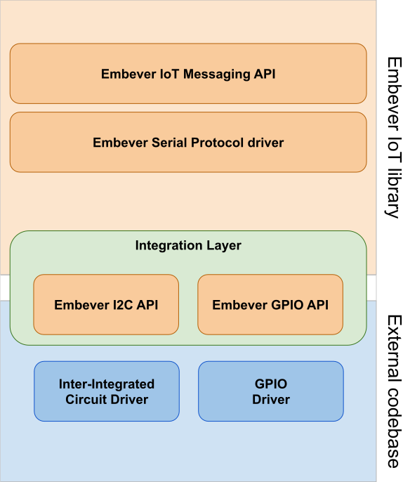

API documentation
=================

.. include:: ../_defs.rst

**Current stable version:** |RELEASE|

The API documentation aims to describe the working principles of the library.
Showing how to use it and how to interact with it by providing description about
each modules with examples and hinting recommendations.

  The Embever IoT library stack

.. toctree::
   :maxdepth: 1
   :glob:

   ebv_iot_msg
   esp_drv
   integration_layer
   logging