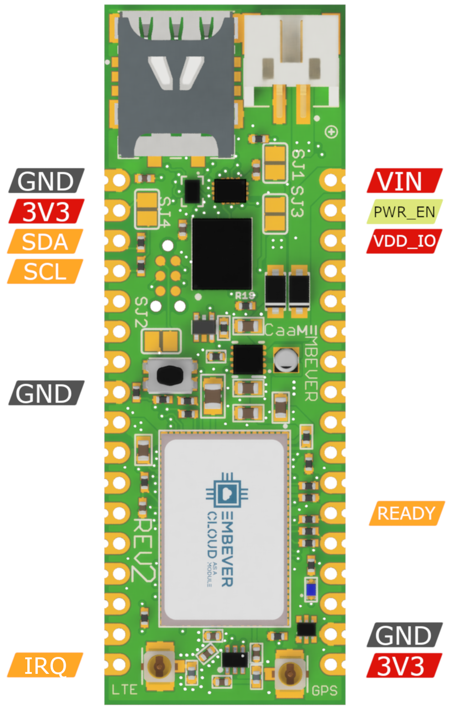

Getting Started
================

This document serves as a guide through the basic steps that are necessary to start building  IoT applications with the Embever Cloud as a Module Development Kit and gives a brief overview of our stack.
The goal is to provide just enough information to be able to get familiar with the IoT world without being too overwhelming. To be able to complete this guide, an Arduino compatible hardware will be necessary.

The Embever CaaM development board
------------------------------------
In the process of getting to know the CaaM board, let it start with a feature highlight.

.. figure:: ./img/CaaM_overview.png
  :width: 600
  :align: center
  :alt: Embever CaaM Development Board

*  **1** Battery connector, JST2B 2mm pitch
*  **2** nanoSIM adapter
*  **3** Cellular antenna connector, U.FL
*  **4** GPS antenna connector, U.FL
*  **5** Reset button
*  **6** Status indicator LED, blue
*  **7** SIM chip, eSIM
*  **8** Buck/Boost voltage regulator circuitry
*  **9** GPS/LTE modem, LTE-M1, NB-IOT

.. _rec_op_conds:

Recommended Operating Conditions
---------------------------------
.. list-table:: Recommended Operating Conditions
   :widths: 25 25 25 25
   :header-rows: 1
   :align: center

   * - Property
     - Min
     - Max
     - Unit
   * - Operating Voltage
     - 1.8
     - 5.5
     - V
   * - VDD_GPIO
     - 1.8
     - 3.6
     - V
   * - Operating Temperature
     - -20
     - 85
     - °C
   * - Peak Power Consumption
     -
     - 1
     - A


Jumper Configuration
---------------------
Solder jumpers can be used to modify the behavior of the hardware. The location of these solder jumpers are shown in the following figure:

.. figure:: ./img/SJ_HL.png
  :width: 600
  :align: center
  :alt: Embever CaaM Development Board Solder Jumpers


The solder jumpers have the following functionalities:

.. list-table:: Solder Jumpers
   :widths: 25 25
   :header-rows: 1

   * - Solder jumper
     - Functionality
   * - SJ1
     - Short to activate the external SIM card.

       If this solder jumper is shorted, the modem starts using the nanoSIM instead of the eSIM.
   * - SJ3
     - Short to set the GPIO logic level to 3.3V.

       There is the option to select the voltage level of the GPIO pins, which can be anything between 1.8v and VCC.

       It can be useful when you wish to interface with a device which is running on a lower voltage level than 3.3v.
   * - SJ2
     - Short to connect the board VCC with the TAG connector VCC pin.

       It might be required by an external programmer if the firmware of the modem is to be updated manually.
   * - SJ4
     - Short to activate pullup resistors on i2c lines.

       The pullup resistors are necessary to communicate with the device.

       Use external pullup resistors if you do not wish to use the internal ones.

.. _getting-started-hw-wiring:

Wiring up the hardware
-----------------------
For using the Embever CaaM development board, it has to be connected to an external device. To establish digital communication with the CaaM development board, there are a few necessary signals that need to be connected.
The following figure shows the location of these signals by board versions:

.. raw:: html

   <details>
   <summary><a>CaaM board revision 2</a></summary>


.. list-table:: ESP Pinout
   :widths: 25 25
   :header-rows: 1
   :align: center

   * - Signal Name
     - Description
   * - VIN
     - Supply Voltage input
   * - GND
     - Ground
   * - PWR_EN
     - Enable power, active LOW, enabled by default
   * - VDD_IO
     - Supply Voltage for GPIO Pins
   * - 3V3
     - Internal voltage regulator output
   * - SDA
     - ESP data line
   * - SCL
     - ESP clock line
   * - IRQ
     - ESP logic line, active low
   * - READY
     - ESP logic line, active high
  
.. raw:: html

   </details>

.. raw:: html

   <details>
   <summary><a>CaaM board revision 2.1</a></summary>
.. figure:: ./img/ESP_HL.png
  :width: 400
  :align: center
  :alt: Embever CaaM Development Board ESP Signals

.. list-table:: ESP Pinout
   :widths: 25 25
   :header-rows: 1
   :align: center

   * - Signal Name
     - Description
   * - VIN
     - Supply Voltage input
   * - GND
     - Ground
   * - PWR_EN
     - Enable power, active LOW
   * - VDD_IO
     - Supply Voltage for GPIO Pins
   * - 3V3
     - Internal voltage regulator output
   * - SDA
     - ESP data line
   * - SCL
     - ESP clock line
   * - IRQ
     - ESP logic line, active low
   * - READY
     - ESP logic line, active high

.. raw:: html

   </details>
   <br></br>


Powering the Embever CaaM development board
--------------------------------------------
There are multiple ways to supply the Embever CaaM development board.
The JST connector can be used to attach an external battery.
The VIN pin can also be used to supply power from the pin header.
The specification that needs to be considered is the input voltage range that the CaaM development board can safely use and the current delivery capability of the external power source.
To get those values, take a look at the :ref:`rec_op_conds`.

On the other hand, the CaaM development board can also be used to provide power output through the 3V3 pin.
It can provide 3.3 Volt to an external device (150mA max).

Digital communication logic level
-------------------------------------
It is necessary to match the logic level between an external device and the Embever CaaM development board to establish stable communication.
This is possible by supplying any voltage in the supported voltage range to the VDD_IO pin.
To omit the wiring for this pin, the SJ3 solder jumper can be used to set the logic voltage level to VCC which is 3.3 Volt.

Communication with the Embever CaaM development board
--------------------------------------------------------
To address digital communication with the Embever CaaM development board a lightweight protocol is used, the Embever Serial Protocol (ESP).
For more information about it, see :ref:`esp-prot-drv`.

To use the Embever Serial Protocol, connect an external device based on the following table:

.. list-table:: ESP Wiring
   :widths: 25 25
   :header-rows: 1
   :align: center

   * - Signal name
     - Description
   * - SDA
     - Serial Data
   * - SCL
     - Serial Clock
   * - READY
     - Device ready to receive
   * - IRQ
     - Data available to read


| Note: Make sure to use an Arduino board that fulfils the voltage level requirements. The Embever CaaM board is not 5V tolerant. For example, to be able to use an Arduino UNO board, a voltage level shifter might be necessary.

Embever IoT software library
-----------------------------
To make it even simpler, Embever provides an additional software library that handles the ESP on its own.
There is no need to fully understand our protocol and implement a custom software library to be able to use the Embever CaaM development board.
With this simplicity, starting to work on an IoT application was never that easy, without the heavy proprietary communication protocol handling.
The Embever IoT software library is platform-independent and does not contain any peripheral drivers. In this way, it can be easily integrated into any existing environment.
To create sample applications, we chose the Arduino framework to make communication possible between an external device and the Embever CaaM development kit.
In our mind, the Arduino Framework is a great tool to show how things work and the idea is easily adaptable to other platforms as well.

Summary
--------
To summarize the above topics before starting to work with the examples:
  * Configure the hardware by shorting the right solder jumpers based on the required behavior
  * Connect the CaaM board with an external device
  * Supply power to the system, the easiest way is to use a lithium polymer battery with a JST connector


Introducing the Embever Cloud System
----------------------------------------
Embever IoT Core is responsible to handle all messaging to and from a device. The Embever IoT Core provides an API to easily send and receive data from a device.
Besides this, it can also be used to manage resources like devices and firmwares.

.. include:: ./activate_cloud_acount.rst
.. include:: ./cloud_device_connect.rst

Setting up the Arduino environment
------------------------------------
The Arduino IDE is a well known integrated development environment to support all kinds of Arduino compatible devices.
The Arduino IDE needs to be installed in order to compile the Embever IoT library.
Moreover there are 2 necessary modifications that need to be done on the Arduino Wire library before it would be usable to work with the Embever IoT library.
The Embever IoT library needs to send longer messages that the default Arduino Wire library can handle. The easiest way to locate them is to get information about the Arduino Core library location.
The Arduino IDE carries this information under the Preference sub menu.

.. figure:: ./img/Arduino_IDE_code_HL.png
  :width: 600
  :align: center
  :alt: Embever CaaM Development Board Solder Jumpers

The following path shows the location of the arduino core. Using this example, in this case the files can found in the following location:
``/Users/macbook/Library/Arduino15/packages/arduino/hardware/avr/1.8.3/libraries/Wire/src/Wire.h```
``/Users/macbook/Library/Arduino15/packages/arduino/hardware/avr/1.8.3/libraries/Wire/src/utility/twi.h``

| Note: This location will vary on other systems!

Change the following lines according to the following:

.. list-table:: Wiring library modifications
   :widths: 25 25 25 25
   :header-rows: 1
   :align: center

   * - File
     - Location
     - Change from
     - Change to
   * - ``Wire.h``
     - line 29
     - ``#define BUFFER_LENGTH 32``
     - ``#define BUFFER_LENGTH 128``
   * - ``Twi.h``
     - line 34
     - ``#define TWI_BUFFER_LENGTH 32``
     - ``#define TWI_BUFFER_LENGTH 128``

With this modification, the Embever IoT library will be able to send the right messages over I2C.

Setting up the Embever IoT library in Arduino IDE
--------------------------------------------------
To be able to use the Embever IoT library, it need to be installed to the Arduino IDE first. The Embever IoT library is depends on the CWPack library.

Download the libraries from the following links by the download source code button and select the .zip option:
  * `Embever IoT Library <https://github.com/Embever/embever-iot-library>`_
  * `CWPack Library <https://github.com/Embever/cwpack>`_

Add the downloaded files to the Arduino IDE:
  * 1 Open Arduino ID
  * 2 Select: ``Sketch / Include Library / Add .ZIP Library…``
  * 3 Add both downloaded files in this way

To open an example from the Embever IoT library from the Arduino IDE select ``File / Examples / Embever IoT Library / Hello_Cloud``.
Compile the Sketch and Upload to the device and open the Serial Terminal from the Arduino IDE to see the logs.

To see the result in the Embever Cloud System go to the...

Modifying the Hello_Cloud example
----------------------------------
Extending the Hello_Cloud example is a great way to get familiar with the Embever IoT library and with the Embever Cloud System.
Let’s extend the existing payload by adding another key value pair to it. Add the following line just under line 31:
ebv_iot_addGenericPayload("description", "first_demo");

.. figure:: ./img/Hello_Cloud_mod.png
  :width: 600
  :align: center
  :alt: The modified hello_cloud sketch

Verify the result in the cloud system after the sketch was uploaded to the device.
Working with the Embever IoT solution is fun because it has a lot of potential to build and deploy the IoT applications of the future.
To see more examples, dig deeper in the library and read about the whole API, check the Embever IoT library documentation here.
