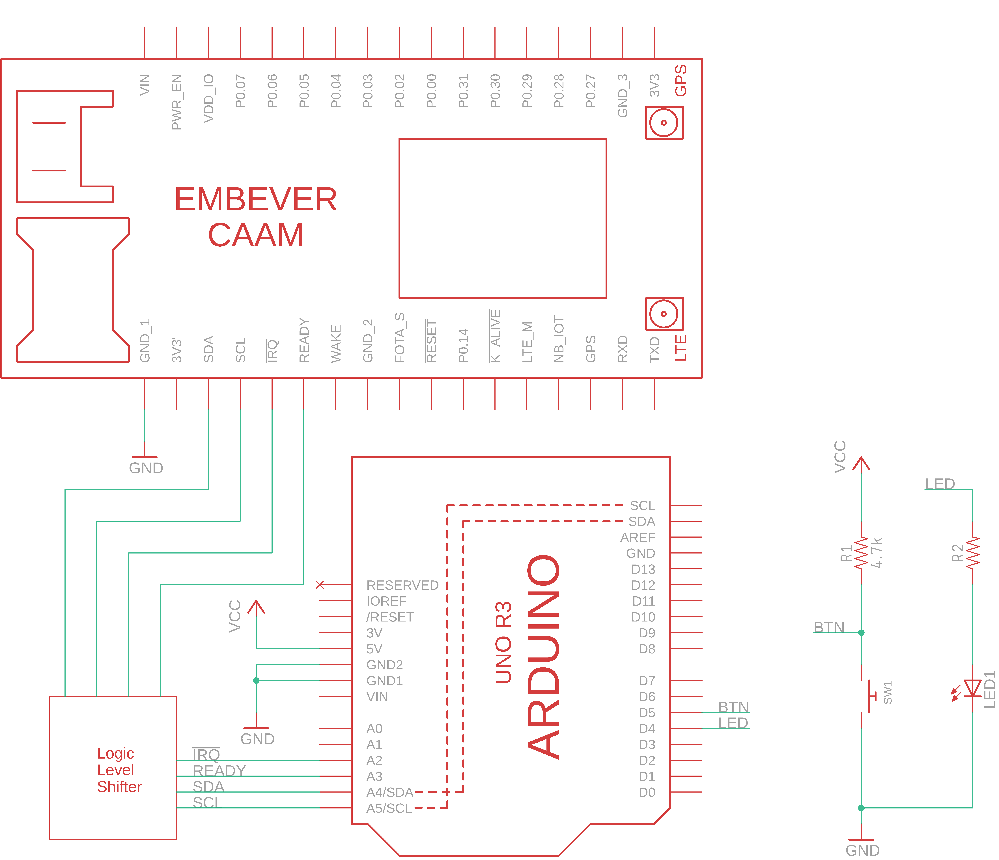

.. _wiring_led_btn:

Wiring Diagram With Additional Component
=============================================
The following diagram is showing an overview about connecting the Embever IoT module to
an Arduino UNO. In this setup there is 2 additional component connected.
An applicable logic level shifter can be any of the following:

* `SparkFun Logic Level Converter - Bi-Directional <https://www.sparkfun.com/products/12009>`_
* `4-channel I2C-safe Bi-directional Logic Level Converter <https://www.adafruit.com/product/757>`_
* `TXB0104 Bi-Directional Level Shifter <https://www.adafruit.com/product/1875>`_
  
